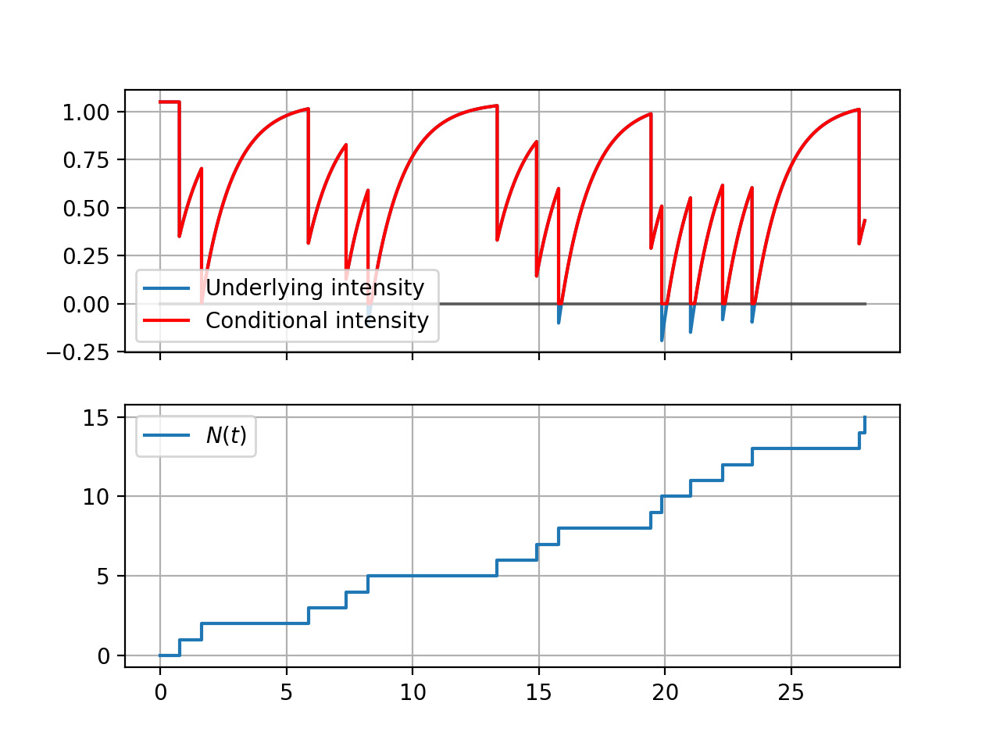

# MLE for Exponential Hawkes Process

Source code for [Maximum likelihood estimation for self-regulating Gaussian Hawkes process]"""insert paper link here""".

It includes a class to simulate an univariate Hawkes process and functions to compute the log-likelihood presented in the aforementioned paper along with the approximated version from Lemonnier's work [[1]](#1).

## Example

We include two examples of application, one for simple plotting with the ```exp_thinning_hawkes``` class, shown below, and another one implementing the algorithm of estimation.

As a remainder for the parameters of the function, the intensity function considered is:

```py
import numpy as np
from matplotlib import pyplot as plt
from hawkes_process import exp_thinning_hawkes

# Fix the example's random seed.
np.random.seed(0)
# Create a process with given parameters and maximal number of jumps.
hawkes = exp_thinning_hawkes(lambda_0=1.2, alpha=-0.4, beta=0.8, max_jumps=15)
hawkes.simulate()
# Plotting function of intensity and step functions.
hawkes.plot_intensity()

plt.show()

```

This example must yield the following plot:



## Dependencies

This code was implemented using Python 3.8.5 and needs Numpy, Matplotlib and Scipy.


## References

<a id="1">[1]</a>
R. Lemonnier, N. Vayatis, Nonparametric markovian learning of triggering kernels for mutually exciting and mutuallyinhibiting multivariate hawkes processes, in: Machine Learning and Knowledge Discovery in Databases, Springer BerlinHeidelberg, 2014, p. 161–176
